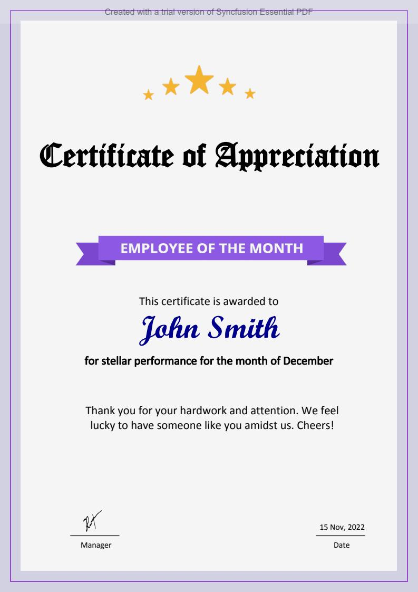

##### Example: EmployeeCertificate

# Purpose
The EmployeeCertificate project is an example of the employee certificate generation. The example demonstrates a simple one-page document that includes a text, images.

# Prerequisites
1) **Visual Studio 2017** or above is installed.
   To install a community version of Visual Studio use the following link: https://visualstudio.microsoft.com/vs/community/
   Please make sure that the way you are going to use Visual Studio is allowed by the community license. You may need to buy Standard or Professional Edition.

2) **.NET Core SDK 2.1** or above is installed.
   To install the framework use the following link: https://dotnet.microsoft.com/download

# Description

### Image
Images for the project is located in the **Assets/** folder.

### Output file
The example creates the file **EmployeeCertificate.pdf** in the output **bin/(debug|release)/net6.0** folder.

Refer to the following Output screenshot 
